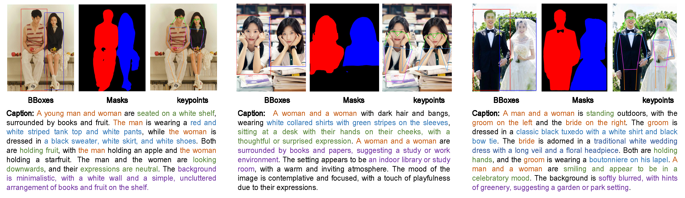
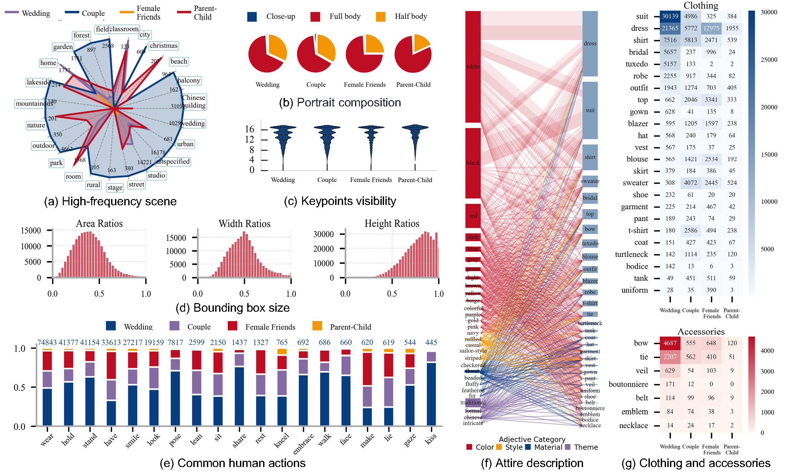

## PairHuman: A High-Fidelity Photographic Dataset for Customized Dual-Person Generation
**This data is a high-quality benchmark dataset specifically designed for dual-person portrait generation.**

## 💡 Highlights

- 🔥  **Extensive and diverse visual content:** PairHuman contains over 100K images, covering four primary topics: couples, weddings, female friends, and parent-child. Each topic provides a wide variety of scenes, attire, actions, and compositions. 

- 🔥  **High photographic fidelity:** The dataset provides high-resolution, realistic images that adhere to photographic standards. 

- 🔥  **Standardized dual-person portraits:** Every image in PairHuman consistently includes two individuals, ensuring methods can generate dual-person portraits with greater accuracy and consistency. 

- 🔥  **Rich data annotations:** The dataset includes detailed captions, attribute tags about individuals and scenes, human bounding boxes, masks, human keypoints, and face bounding boxes.

## Dataset Comparison
| **Dataset** | **Image** | **Human-Centric** | **Photographic Quality** | **Two Person** | **Detailed Captions** | **Attribute Tags** | **Human BBoxes** | **Human Masks** | **Key-points** | **Face BBoxes** |
| --- | --- | --- | --- | --- | --- | --- | --- | --- | --- | --- |
| Laion400M & Laion 5B| 47B/58.5B | ❌ | ❌ | ❌ | ❌ | ❌ | ❌ | ❌ | ❌ |
| ShareGPT4V & ShareGPT4V-pt | 100K/1000K | ❌ | ❌ | ❌ | ✅ | ❌ | ❌ | ❌ | ❌ |
| RefClef  | 19k | ❌ | ❌ | ❌ | ❌ | ❌ | ❌ | ❌ | ❌ | ❌ |
| RefCOCO, RefCOCO+, RefCOCOg | 20k-25.8k | ❌ | ❌ | ❌ | ❌ | ✅ | ✅ | ✅ | ✅ | ❌ |
| MS COCO caption | 328k | ❌ | ❌ | ❌ | ❌ | ✅ | ✅ | ✅ | ✅ | ❌ |
| Flickr30K | 30k | ❌ | ❌ | ❌ | ❌ | ❌ | ❌ | ❌ | ❌ | ❌ |
| ImageNet-1k | 280k | ❌ | ❌ | ❌ | ❌ | ✅ | ✅ | ✅ | ❌ | ❌ |
| Visual Genome  | 100k | ❌ | ❌ | ❌ | ❌ | ✅ | ✅ | ✅ | ❌ | ❌ |
| Nocaps  | 15k | ❌ | ❌ | ❌ | ❌ | ❌ | ❌ | ❌ | ❌ | ❌ |
| FFHQ  | 70k | ✅ | ❌ | ❌ | ❌ | ✅ | ✅ | ✅ | ❌ | ❌ |
| **PairHuman** | 100K | ✅ | ✅ | ✅ | ✅ | ✅ | ✅ | ✅ | ✅ | ✅ |


## Documentation of Annotation Structure
```none
Root
│
├── Information
│   ├── height: Integer
│   │   └── Description: Height of the image in pixels.
│   ├── width: Integer
│   │   └── Description: Width of the image in pixels.
│   ├── Image category: String
│   │   └── Description: Category of the image, such as 'portrait photo'.
│   └── Photo Settings: String
│       └── Description: Descriptive detail about the photo, such as 'Full body'.
│
├── image_caption
│   ├── text: String
│   │   └── Description: Full descriptive caption of the image. 
│   └── match_info: Array of Objects
│       └── Each object contains:
│           ├── sentence_ID: Integer
│           │   └── Description: Identifier for each sentence in the caption.
│           ├── sentence: String
│           │   └── Description: Text of the specific sentence in the caption.
│           └── person_info: Array of Objects
│               └── Each object contains:
│                   ├── words: String
│                   │   └── Description: Specific word describing the person, e.g., 'man', 'woman'.
│                   ├── start_idx: Integer
│                   │   └── Description: Start index of the word in the sentence.
│                   └── end_idx: Integer
│                       └── Description: End index of the word in the sentence.
│
├── people: Array of Objects
│   └── Each object contains:
│       ├── object_id: String
│       │   └── Description: Unique identifier for the person.
│       ├── gender: String
│       │   └── Description: Gender of the person, e.g., 'male', 'female'.
│       ├── age_group: String
│       │   └── Description: Age group of the person, e.g., 'young'.
│       ├── unique_coordinate: Array of Floats
│       │   └── Description: Coordinates for the person in the image, format: [x_min, y_min, x_max, y_max].
│       ├── facial_traits: String
│       │   └── Description: Descriptive traits of the person's face, e.g., 'short dark hair'.
│       ├── hair_detail: String
│       │   └── Description: Specific details about the person's hair, e.g., 'short', 'curly', 'bald'.
│       ├── skin_tone: String
│       │   └── Description: Skin tone of the person, e.g., 'light', 'medium', 'dark'.
│       ├── action: String
│       │   └── Description: Physical action the person is doing, e.g., 'sitting', 'standing'.
│       ├── expression: String
│       │   └── Description: Facial expression at the time the image was taken, e.g., 'neutral', 'smiling'.
│       ├── details_of_clothes_and_shoes: String
│       │   └── Description: Description of the attire the person is wearing, including clothing and footwear.
│       ├── accessories: String
│       │   └── Description: Any accessories the person is wearing, e.g., 'glasses', 'none'.
│       └── keypoints: Array of Arrays
│           └── Description: Array of keypoints represented as coordinates within the image, providing details about specific anatomical landmarks. Format: [[x, y, confidence], ...].
│
└── objects: Array of Objects
    └── Each object contains:
        ├── object_id: String
        │   └── Description: Identifier for the object.
        ├── count: String
        │   └── Description: Quantity of the particular object.
        ├── appearance: String
        │   └── Description: What the object looks like.
        └── interaction: String
            └── Description: How the object interacts with the scene or people.
```

## Annotation Examples

Examples of PairHuman Dataset Annotations, including bounding boxes, keypoints, masks, and image captions. Image captions are color-coded for clarity: orange for persons, green for actions, blue for attire, and purple for backgrounds.

## Statistics

(a) Distribution of high-frequency shooting scenes, (b) Distribution of full-body, half-body, and close-up portraits, (c) Visibility of keypoints in training and testing sets, (d) Ratio distribution of human bounding box area, height, and width relative to the entire image, (e) Distribution of common human actions, (f) Correlation between attire items and descriptive adjectives, (g) Frequency distribution of clothing and accessories.

## Usage and License Notices

### Data Curation and Ethical Standards
The PairHuman dataset was curated with strict standards to ensure that all content adheres to ethical guidelines:
- **Content Quality**: All images in the dataset have been manually reviewed to ensure they are free from pornography, violence, bias, or discrimination.
- **Anonymity and Privacy**:  Data annotations do not include any personally identifiable or biometric information (e.g., facial identity). Only general attribute information is included, such as gender, age range, attire, and actions.
- **Metadata Removal**: All EXIF data, geolocation tags, and source metadata have been systematically stripped from images to prevent accidental privacy disclosure.
- **Sensitive Content Exclusion**: Images depicting private or sensitive scenarios were excluded during manual screening.

### Synthetic Face Replacement Pipeline

To preserve the rich diversity of clothing, poses, and scenes in the original dataset while ensuring privacy compliance, we implemented a face replacement-based anonymization strategy. Using Flux, we generated a varied library of synthetic faces representing adults and children of different genders. These synthetic faces were then used in FaceFusion to replace all original faces in the dual-portrait images.

The replacement process was carefully designed to accommodate four distinct types of portraits in our dataset:

- **Wedding and couple portraits (different genders)**: We sequentially replaced the faces by first configuring the “face_selector_gender” parameter to ‘male’ to replace the male subject, and then switching the parameter to ‘female’ to replace the female subject.
- **Female friends portraits (same-gender pairs)**: We performed the replacement in two steps: initially setting the “face_selector_order” to left-right to replace the first face, and then changing it to right-left to replace the second.
- **Parent-child portraits**: We utilized the original age and gender annotations within the dataset to guide the replacement process. The “face_selector_age” parameter was first set to 0-15 to identify and replace the child's face, selecting a synthetic child face of the corresponding gender from our pre-generated library. Subsequently, the “face_selector_age” was adjusted to 20-100 to target the parent's face, which was then replaced with a synthetic adult face matching the parent's annotated gender.

## 📂 PairHuman Dataset (Subset Release)

We release an anonymized subset of ~1,500 images from PairHuman, covering four representative categories of dual-person portraits. This subset offers the community an accessible sample of the dataset for reproducibility and early experimentation.  

We are currently extending the anonymization pipeline to the entire dataset, and a fully anonymized release will follow to ensure accessibility and compliance with international privacy standards.  

🔗 **Download (Hugging Face):** [PairHuman01.zip](https://huggingface.co/datasets/Pan1111/PairHuman01.zip)


